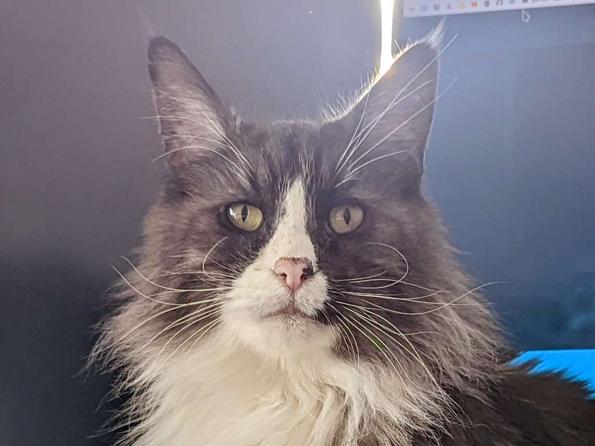
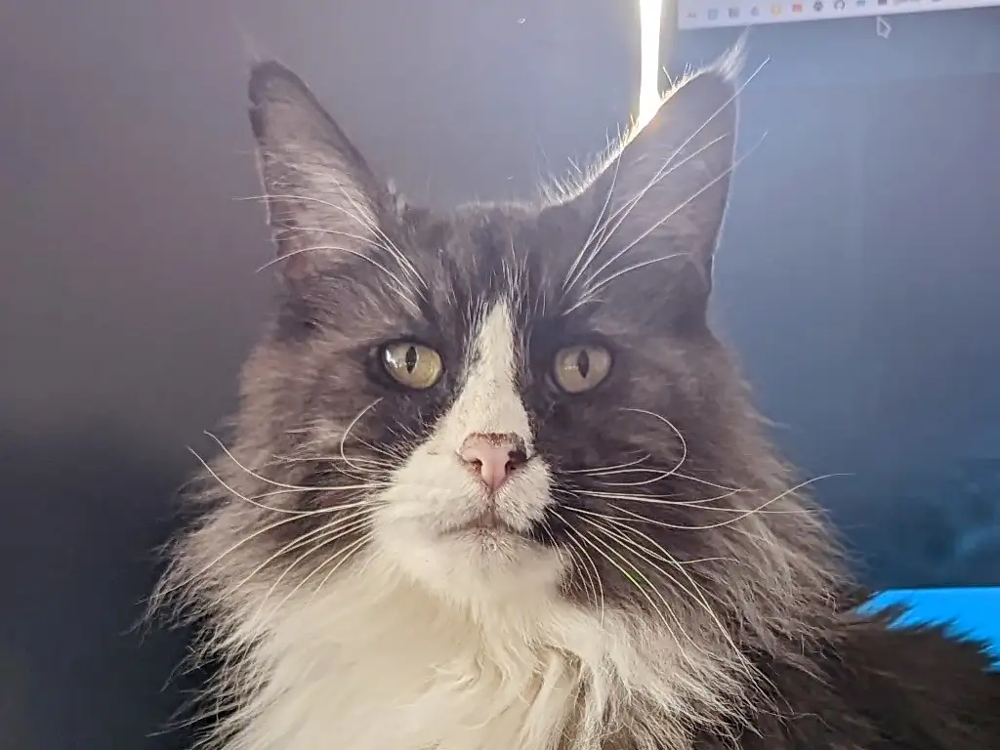

+++
title = "A simple image shortcode for Zola"
date = 2023-08-26
[taxonomies]
tags = ["blog"]
[extra]
thumb = "cato.jpg"
+++

As I mentioned in my [first post](/hello), I want to use a very simple
interactive element so users can enlarge the image I add to articles without
having to right click them.

{{ image(src="cato.jpg", title="A photo of my cat") }}

This is a good way to get started with the [Tera template
engine](https://keats.github.io/tera/) used by Zola, and to practice a bit with
Zola's [shortcodes](https://www.getzola.org/documentation/content/shortcodes/),
which enable us to create complex components we can use throughout our site.

The idea is to create a new shortcode to use instead of the usual image markdown
syntax. This shortcode will display a better styled image frame which can be
clicked and takes the user into a full-sized version. Let's write an extremely
simple version:

```htm.j2,linenos
<div class="post-img-container">
  
  
  

  <a href="{{ src }}">
    
  </a>
  <p>{{ title }}</p>
</div>
```

This already improves the original markdown image by navigating to the image on
click. Adding proper styling to the `.post-img-container` class, we can fit it
in a frame and fix the size. But this is still not great: We are loading a
potentially huge image, and it will end up in a much smaller frame (depending on
your styling). So, while we're at it, why not make use of Zola's [image
processing
capabilities](https://www.getzola.org/documentation/content/image-processing/)
and make our shortcode template resize the image?

```htm.j2,linenos,hl_lines=5-6
<div class="post-img-container">
  
  
  
  

  <a href="{{ src }}">
    
  </a>
  <p>{{ title }}</p>
</div>
```
{{ note(text="You can set the width argument to a number that suits your site.") }}

In lines 5-6, we call `resize_image` with our original image. Now, our shortcode
template will generate the extra versions without any action on our part!

We can improve this a bit more. Zola can convert images into
[WebP](https://developers.google.com/speed/webp) with its `resize_image`
function. WebP images compress much better than JPEG:

<div class="compression-comparison">
  <div>
    
    <p><strong>JPEG Image</strong>, 76.3KB</p>
  </div>
  <div>
    
    <p><strong>WebP Image</strong>, 45.9KB</p>
  </div>
</div>

Both of those images are converted from the original with a 60% quality setting.
Although there is a very slight quality difference, the WebP image is about 40%
lighter.

Now, we don't want to use the WebP format alone. Some browsers might not like
it, and then the image won't show at all. But instead of a bare ``, we can
use a [`<picture>`
element](https://developer.mozilla.org/en-US/docs/Web/HTML/Element/picture). You
can nest `<source>` elements inside of a `<picture>` element, and specify a
`srcset` property in these. In `srcset`, you can define different conditions
(like width or pixel density) for the selection of a particular source instead
of the others.

We just want the browser to choose the WebP image instead of the Jpeg if it is
capable of doing so. For this, simply adding a `source` with it will be enough.
The best part is Zola will generate all these different versions of the image
automatically.

```htm.j2,linenos,hl_lines=5-6 11-14
<div class="post-img-container">
  
  
  
  
  

  <a href="{{ src }}">
    <picture>
      <source srcset="{{ iwebp.url }}" type="image/webp">
      
    </picture>
  </a>
  <p>{{ title }}</p>
</div>
```

In lines 5-6, we generate a WebP version of our image. In lines 11-14, we've
changed the `` for a `<picture>` element which includes a nested `<source>`
with that new image.

To easily change the quality of all the images in our site, we add some
definitions to our `config.extra` field in `./config.toml`:

```toml
[extra]
# Put all your custom variables here

jpeg_quality = 60
webp_quality = 60
```

Now, instead of the usual ` title` markdown syntax, we can
write something like:

```html.j2
{{ /* image(src="cato.jpg", title="A photo of my cat") */ }}
```
{{ note(text="Note the /* */ are there just to avoid the blog engine parsing the
line.") }}

You can style it however you want. if you want to know how I styled mine, you
can head to the [blog's GitHub
repo](https://github.com/javfg/blog/tree/master/sass) and take a look at the
SCSS.

A further improvement could be changing the `a` link to a WebP-compressed
alternative instead of the original.
